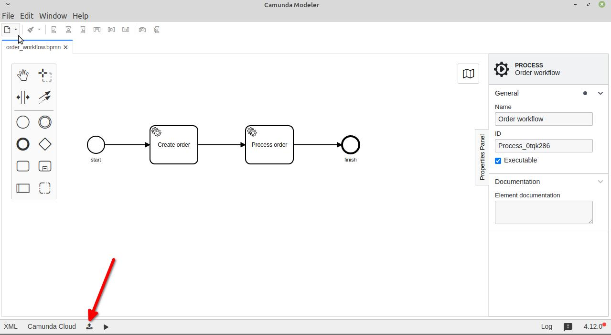
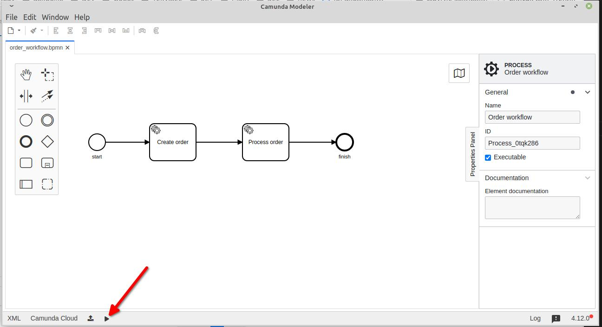
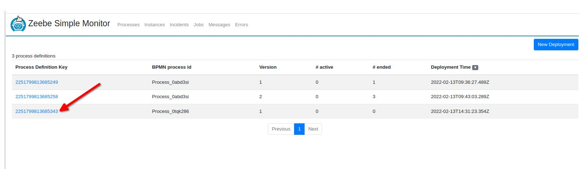
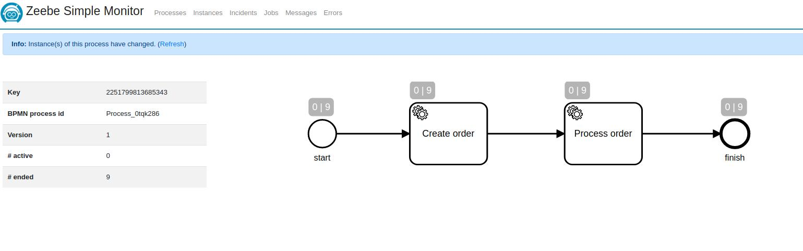

# ZeebeWorker
Camunda [zeebe](https://docs.camunda.io/docs/components/zeebe/zeebe-overview/) worker writen on Ruby.

## Installation

Add this line to your application's Gemfile:

```ruby
gem 'zeebe_worker'
```

And then execute:

    $ bundle install

Or install it yourself as:

    $ gem install zeebe_worker

## Usage
Look at examples folder.
To run example:
1) Start zeebe and Zeebe Simple Monitor - go to the example folder and run
```bash
docker-compose up
```
2) Get and run [Camunda Modeler](https://camunda.com/download/modeler/)

Deploy order_workflow.bpmn file from example folder to zeebe


3) Start ruby zeebe worker from example folder
```bash
ruby worker.rb
```
4) From Camunda Modeler start process workflow (create process instanse)
 
6) To monitor and debug workflow connect to simple monitor web interface - http://http://localhost:8082


## Development
After checking out the repo, run `bin/setup` to install dependencies. Then, run `rake spec` to run the tests. You can also run `bin/console` for an interactive prompt that will allow you to experiment.

To install this gem onto your local machine, run `bundle exec rake install`. To release a new version, update the version number in `version.rb`, and then run `bundle exec rake release`, which will create a git tag for the version, push git commits and the created tag, and push the `.gem` file to [rubygems.org](https://rubygems.org).
## Contributing
Bug reports and pull requests are welcome on GitHub at https://github.com/[USERNAME]/zeebe_worker.
## License
The gem is available as open source under the terms of the [MIT License](https://opensource.org/licenses/MIT).
